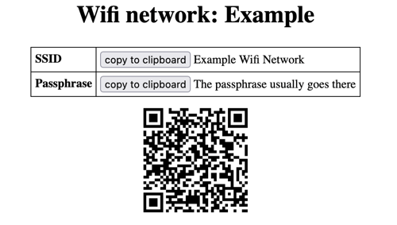

# wifi_qrcode_generator

## Description

A simple/naive Python script that generates *standalone* QRCodes for Wifi
networks via a toml file and outputs an HTML page (rendered via Jinja2).

Used to ease addition of Wifi networks with lengthy and/or rotating
passphrases (like guest networks), as long as the device supports QRCode scanning.

## How-to use

Make sure you have QRCode, Jinja and toml dependencies installed:

~~~shell
pip install jinja2
pip install qrcode
pip install toml
~~~ 

Then pass to stdin a toml-like file that contains all the needed elements to
output the proper HTML page:

~~~shell
$ git clone https://github.com/jymigeon/wifi_qrcode_generator.git
$ cd wifi_qrcode_generator.git
$ cat wifi.toml
title = "Wifi network: Example"
type = "WPA2" # WEP, WPA or WPA2
ssid = "Example Wifi Network"
passphrase = "The passphrase usually goes there"
'''
$ python wifi_qrcode_generator.py < wifi.toml > wifi.html
~~~

Will output the [following HTML](./wifi.html), as based on the provided [Jinja2 template](./template.j2):

## Rationale

It was surprisingly difficult to find an adequate source for this over the web.
Often the documentations recommend using an opaque third party web
"service" that either requires you to "upload" passphrases/credentials (or
trust some Javascript code to remain local only), or
generate a clicky HTTP Redirect link towards the information.

So in addition to the exposure of credentials you should not share
too broadly, these require Internet-wide access (... which is precisely
what this QRCode is supposed to offer initially).

Neither should be necessary. So here we are.
